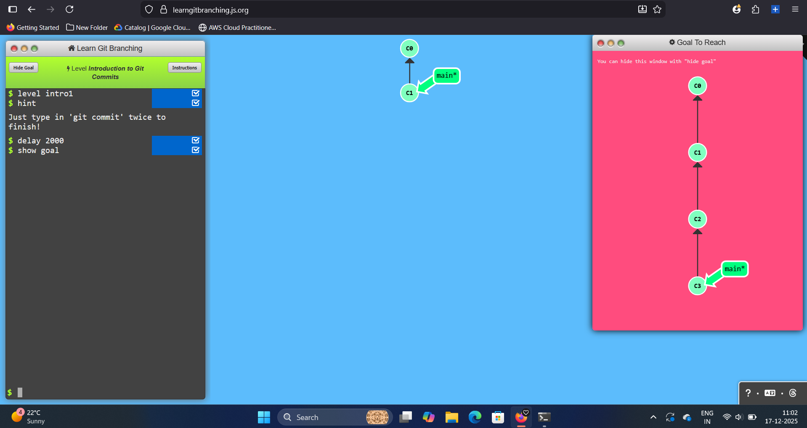
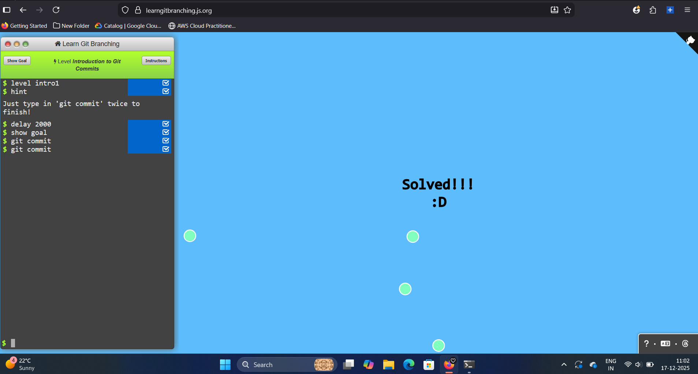
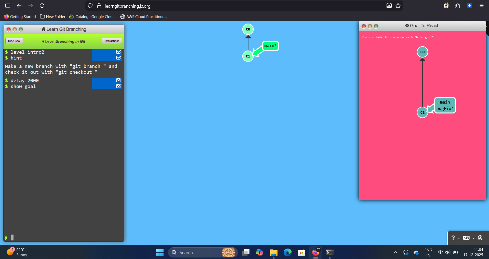
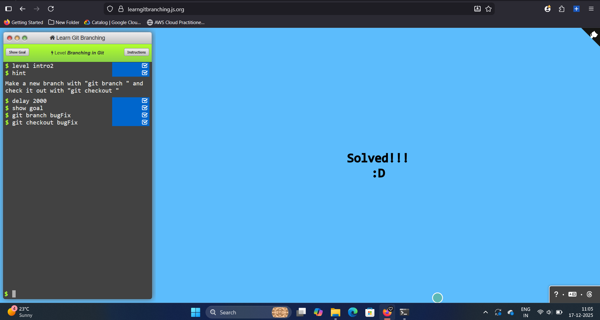
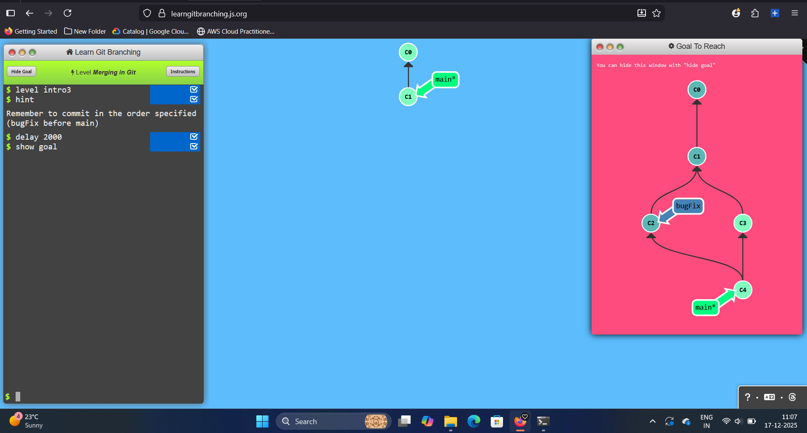
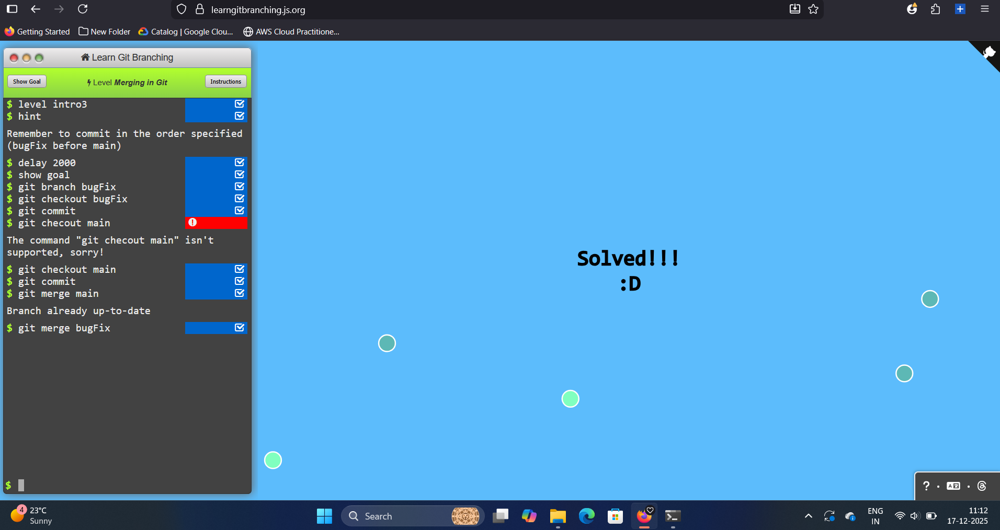

# Documenting the journey of learning git

A documented Git learning journey using LearnGitBranching, including key concepts, commands, and screenshots as proof of hands-on practice.

## 1. Introduction
In this level, I learnt the basics of Git commits, how changes are saved as commits and how Git tracks project history using them.

`git commit`

## 2. Branching
In this level, I learnt how Git branches work, how to create new branches, and how branching allows parallel development without affecting the main codebase.

`git branch <branch-name>`
`git checkout <branch-name>`

## 3. Merging
In this level, I learnt how to merge branches in Git and how changes from one branch are combined into another, helping integrate feature work into the main branch.

`git merge`

## 4. Rebase
In this level, I learnt how rebasing works in Git and how it reapplies commits on top of another branch to create a clean, linear commit history.

`git rebase`

Through this learning using LearnGitBranching, I gained a clear understanding of how Git works internally from creating commits and managing branches to integrating changes using merging and rebasing. 

| Command                       | Description                                                       |
| ----------------------------- | ----------------------------------------------------------------- |
| `git init`                    | Initializes a new Git repository                                  |
| `git status`                  | Shows the current state of the working directory and staging area |
| `git add .`                   | Stages all changes for commit                                     |
| `git commit -m "message"`     | Saves staged changes as a commit                                  |
| `git log`                     | Displays commit history                                           |
| `git branch`                  | Lists or creates branches                                         |
| `git checkout <branch>`       | Switches to another branch                                        |
| `git checkout -b <branch>`    | Creates and switches to a new branch                              |
| `git merge <branch>`          | Merges a branch into the current branch                           |
| `git rebase <branch>`         | Reapplies commits on top of another branch                        |
| `git remote add origin <url>` | Connects local repo to remote GitHub repo                         |
| `git push -u origin main`     | Pushes local commits to GitHub                                    |

This repository reflects my foundational understanding of Git and version control through structured learning and practice. By documenting each concept with screenshots and commands, I have built confidence in using Git for real-world development workflows and collaborative projects.

This repository serves as a personal reference and proof of hands-on Git learning.

